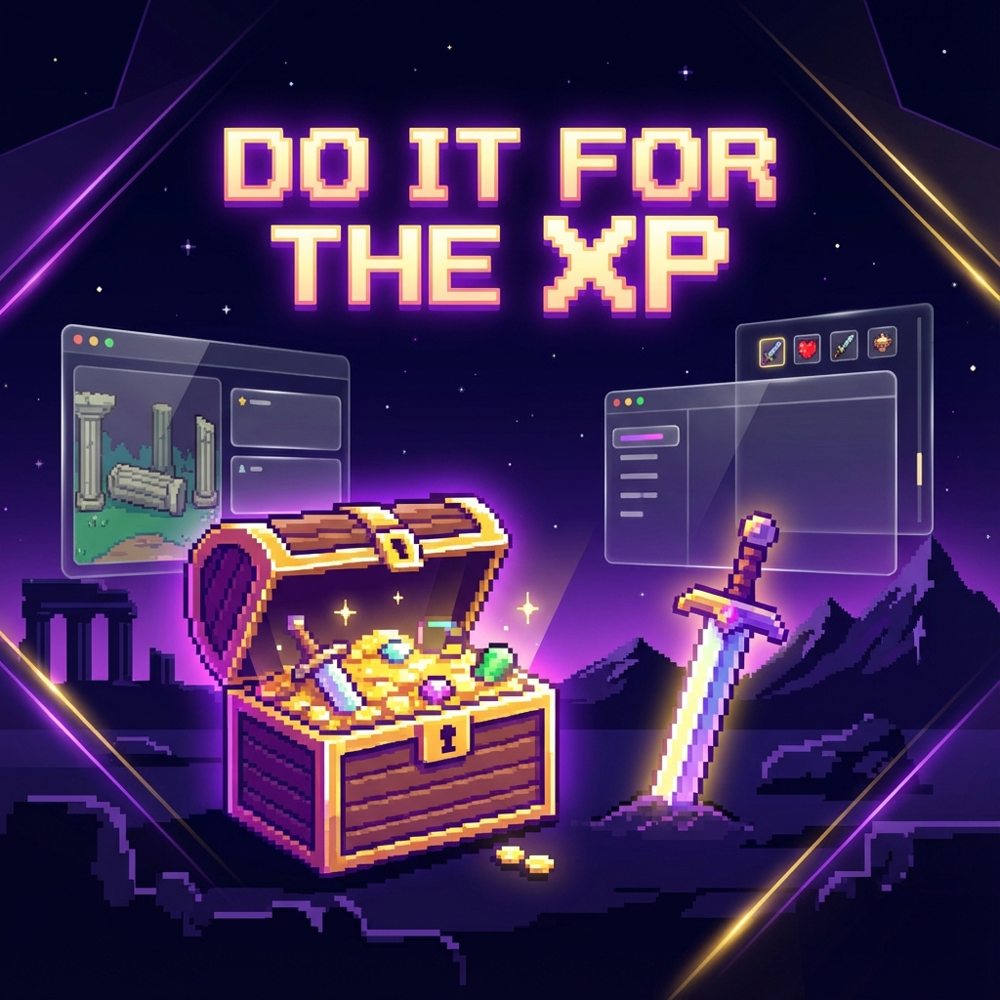

<div align="center">



# ⚔️ Do It For The XP ⚔️

**Transform mundane chores into epic quests. Level up your life!**

[](https://vuejs.org/)
[](https://ionicframework.com/)
[](https://pinia.vuejs.org/)
[](https://www.typescriptlang.org/)
[](https://tailwindcss.com/)
[](https://capacitorjs.com/)

</div>

---

## 📖 The Philosophy

**Do It For The XP** is more than just a task manager; it's a gamified productivity engine that treats real-world responsibilities as RPG-style quests. Inspired by classic SNES-era RPGs like *Earthbound*, it brings flavor, humor, and a sense of progression to the daily grind.

In this ecosystem:
- 🛡️ **Parents / Managers** act as **Game Masters (GM)**, designing the world, setting bounties, and curating the treasury.
- 🤺 **Children / Users** become **Bounty Hunters**, embarking on quests to earn XP, gold, and prestigious titles.

---

## 🏛️ The Three Pillars

The application is architected around three core domains:

### 1. 🛡️ The Game Master Console
*Found in `src/app/Admin/`*
Manage the game world through a specialized suite of tools:
- **Compendium**: The central database for Achievements (Quests), the Bestiary (Enemies), Abilities, and Loot.
- **Temple Creator**: A sophisticated "Dungeon Maker" style interface to build training grounds and challenges.
- **Dashboard**: High-level telemetry on player progress and world state.

### 2. ⚔️ The Player Portal
*Found in `src/app/Console/MyPortal/`*
The "Home" of the adventurer:
- **My Home**: Manage your calendar, cook meals for buffs, and track personal growth.
- **Hometown**: Visit the Bank to invest gold, the Hospital for healing, and the Shop for legendary gear.
- **World Map**: Navigate between regions and discover new content.

### 3. ⚙️ Core Game Engine
*Found in `src/lib/engine/`*
The logic that powers the experience:
- **Active Time Battle (ATB)**: A real-time combat system where tasks represent enemy encounters.
- **Economy System**: Complex logic for XP, GP, and AP scaling.
- **Temple Engine**: Spatial logic for dungeon exploration and room-based events.

---

## 📊 The Point System

Every action has a reaction. Master these stats to survive:

| Symbol | Stat | Description |
| :---: | --- | --- |
| ⚔️ | **XP** | **Experience Points**. Gain enough to level up your character and unlock power. |
| 🔮 | **AP** | **Ability Points**. Spent on specialized class skills and arcane magic. |
| 💰 | **GP** | **Gold Points**. The lifeblood of the economy. Spend at the Store or save at the Bank. |
| ❤️ | **HP** | **Health Points**. Your stamina. Depleted by failed "Trap" tasks or monster attacks. |
| ✨ | **MP** | **Magic Points**. The energy required to cast spells and use active equipment. |

---

## 🛠️ Modern Tech Stack

Built for performance, modularity, and cross-platform reliability:

- **Logic**: [Vue 3](https://vuejs.org/) (Composition API) with [TypeScript 5](https://www.typescriptlang.org/).
- **State**: [Pinia](https://pinia.vuejs.org/) (Replacing legacy Vuex for typed, modular state).
- **UI**: [Ionic 7](https://ionicframework.com/) for mobile-native feel + [TailwindCSS](https://tailwindcss.com/) for precision styling.
- **Animation**: [SCSS](https://sass-lang.com/) for retro-style animations and [Earthbound-battle-backgrounds](https://github.com/shakyShane/earthbound-battle-backgrounds).
- **Persistence**: [Capacitor 6](https://capacitorjs.com/) with LocalStorage and Query caching.

---

## 🚀 Getting Started

### Prerequisites
- **Node.js**: >= 16.x
- **Package Manager**: Yarn (recommended) or NPM

### Installation
```bash
# 1. Clone & Enter
git clone https://github.com/xopherdeep/do-it-for-the-xp.git
cd do-it-for-the-xp

# 2. Install
yarn install
```

### Development Quests
| Command | Result |
| --- | --- |
| `yarn dev` | Start the Ionic Dev Server (Live Reload) |
| `yarn serve` | Run the application in the browser |
| `yarn build` | Compile the production-ready build |
| `yarn test:unit` | Execute Jest unit tests |
| `yarn lint` | Sanitize and check code style |

---

## 📂 The Library of Knowledge

The project is extensively documented. For deep dives into specific systems, consult the `docs/` folder:

| Documentation | Focus |
| --- | --- |
| 🗺️ [Project Roadmap](docs/Roadmap.md) | Current phase and future frontiers. |
| 🏗️ [Architecture](docs/Architecture.md) | Technical overview and pattern definitions. |
| 🏰 [Temple System](docs/Temple-System.md) | How the dungeon crawler engine works. |
| ⚔️ [Battle System](docs/Battle-System-Engine.md) | Combat mechanics and task-to-battle logic. |
| 📈 [Leveling Formulae](docs/Player-Stats-Leveling.md) | HP/MP/XP scaling math. |

---

## 📄 License & Sovereignty

This project is **Proprietary**. All rights reserved. 
See the [LICENSE](LICENSE) file for more details.

### 🤝 Contributing
Feedback and detailed bug reports are always welcome. While the core codebase is proprietary, we value community input for the "Bounty Board". Please contact the XP Team before opening Pull Requests.

---

<div align="center">

*Forged with ❤️ and infinite XP by the XP Team.*

</div>
